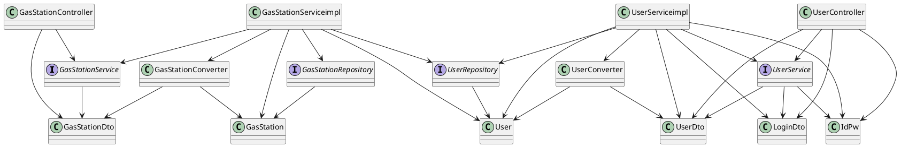
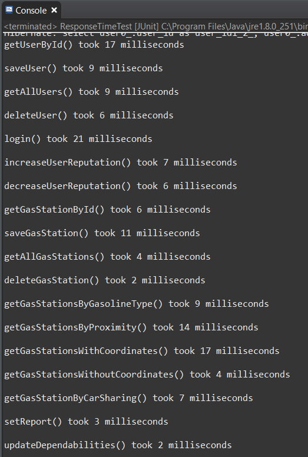

# Integration and API Test Documentation

Authors: Finocchiaro Loredana, Marino Matteo, Mc Mahon Shannon

Date: 26/05/2020

Version: 1

# Contents

- [Dependency graph](#dependency-graph)

- [Integration approach](#integration)

- [Tests](#tests)

- [Scenarios](#scenarios)

- [Coverage of scenarios and FR](#scenario-coverage)
- [Coverage of non-functional requirements](#nfr-coverage)

# Dependency graph 

   

     
# Integration approach

For Integration testing, we adopted a mixed approach, since we followed the bottom up method, but applied also Mockito.  

step1: class UserConverter, GasStationConverter, UserRepository, GasStationRepository  
step2: class UserServiceimpl + UserConverter, GasStationServiceimpl + GasStationConverter  
step3: class UserServiceimpl + UserConverter + UserRepository, GasStationServiceimpl + GasStationConverter + GasStationRepository  

In the step1, we tested Converter and Repository classes singularly: in particular, for Repository we worked with TestEntityManager and @DataJpaTest, in order to avoid affecting the real database.  
In the step2, we mocked Repository methods.  
In the step3, we used again TestEntityManager and @DataJpaTest.

#  Tests

## Step 1
| Classes  | JUnit test cases |
|--|--|
| UserConverter | it.polito.ezgas.UserAndGasStationConverterTest.java |
| GasStationConverter | it.polito.ezgas.UserAndGasStationConverterTest.java |
| UserRepository | it.polito.ezgas.UserRepositoryTest.java |
| GasStationRepository | it.polito.ezgas.GasStationRepositoryTest.java |

## Step 2
| Classes  | JUnit test cases |
|--|--|
| UserServiceimpl + UserConverter | it.polito.ezgas.UserServiceimplTest.java |
| GasStationServiceimpl + GasStationConverter | it.polito.ezgas.GasStationServiceimplTest.java |

In the step 2, we mocked the Repository methods.

## Step 3 API Tests

| Classes  | JUnit test cases |
|--|--|
| UserServiceimpl + UserConverter + UserRepository | it.polito.ezgas.UserServiceimplTestAPI.java |
| GasStationServiceimpl + GasStationConverter + GasStationRepository | it.polito.ezgas.GasStationServiceimplTestAPI.java |

# Scenarios

## Scenario UC2.1

| Scenario |  name |
| ------------- |:-------------:| 
| Description | User U updates his account by changing his e-mail with another one (not already associated to another account) |
|  Precondition     | Account U exists |
|  Post condition     | -  |
| Step#        | Description  |
|  1     | User U modifies his details |  
|  2     | The system checks if the inserted e-mail is already associated to another user account |
|  3     | Update occurs |

## Scenario UC2.2

| Scenario |  name |
| ------------- |:-------------:| 
| Description | User U updates his account by changing his e-mail with another one already associated to another account |
|  Precondition     | Account U exists |
|  Post condition     | -  |
| Step#        | Description  |
|  1     | User U modifies his details |  
|  2     | The system checks if the inserted e-mail is already associated to another user account |
|  3     | Update doesn't occur |

## Scenario UC3.1

| Scenario |  name |
| ------------- |:-------------:| 
|  Precondition     | - |
|  Post condition     | InvalidUserException |
| Step#        | Description  |
|  1     | User U tries to delete an account by inserting a negative userId |  
|  2     | InvalidUserException is thrown |

## Scenario UC4.1

| Scenario |  name |
| ------------- |:-------------:| 
|  Precondition     | - |
|  Post condition     | GPSDataException |
| Step#        | Description  |
|  1     | Administrator creates a new gas station by inserting out of bounds values for latitude and/or longitude |  
|  2     | GPSDataException is thrown |

## Scenario UC4.2

| Scenario |  name |
| ------------- |:-------------:| 
|  Precondition     | - |
|  Post condition     | GasStation not added |
| Step#        | Description  |
|  1     | Administrator creates a new gas station by inserting values of address, latitude and longitude equal to those of a gas station already in the database |  
|  2     | Creation doesn't occur |

## Scenario UC5.1

| Scenario |  name |
| ------------- |:-------------:| 
|  Precondition     | - |
|  Post condition     | GPSDataException |
| Step#        | Description  |
|  1     | Administrator modifies a gas station by inserting out of bounds values for latitude and/or longitude |  
|  2     | GPSDataException is thrown |

## Scenario UC5.2

| Scenario |  name |
| ------------- |:-------------:| 
|  Precondition     | - |
|  Post condition     | GasStation not updated |
| Step#        | Description  |
|  1     | Administrator modifies a gas station by inserting values of address, latitude and longitude equal to those of a gas station already in the database |  
|  2     | Update doesn't occur |

## Scenario UC6.1

| Scenario |  name |
| ------------- |:-------------:| 
|  Precondition     | - |
|  Post condition     | InvalidGasStationException |
| Step#        | Description  |
|  1     | User U tries to delete a gas station by inserting a negative gasStationId |  
|  2     | InvalidGasStationException is thrown |

## Scenario UC7.1

| Scenario |  name |
| ------------- |:-------------:| 
| Precondition     |   -   |
| Post condition   |  PriceException  |
| Step#        | Description  |
|  1     | The user U selects a gas station G |  
|  2     | The system prompts the user with the list of possible fuels provided by the gas station |
|  3     | User U inserts prices that are lower than or equal to 0 |
|  4     | PriceException is thrown |

## Scenario UC7.2

| Scenario |  name |
| ------------- |:-------------:| 
|  Precondition     | - |
|  Post condition     | InvalidUserException |
| Step#        | Description  |
|  1     | The user U selects a gas station G |  
|  2     | The system prompts the user with the list of possible fuels provided by the gas station |
|  3     | The reportUser is set to a negative value |
|  4     | InvalidUserException is thrown | 

## Scenario UC7.3

| Scenario |  name |
| ------------- |:-------------:| 
|  Precondition     | - |
|  Post condition     | InvalidGasStationException |
| Step#        | Description  |
|  1     | The user U selects a gas station G |  
|  2     | The system prompts the user with the list of possible fuels provided by the gas station |
|  3     | The gasStationId is set to a negative value |
|  4     | InvalidGasStationException is thrown | 

## Scenario UC8.1

| Scenario |  name |
| ------------- |:-------------:| 
|  Precondition     | - |
|  Post condition     | GPSDataException |
| Step#        | Description  |
|  1     | Anonymous user U tries to perfom a search by inserting out of bounds values for latitude and/or longitude |  
|  2     | GPSDataException is thrown |

## Scenario UC8.2

| Scenario |  name |
| ------------- |:-------------:| 
|  Precondition     | - |
|  Post condition     | InvalidGasTypeException |
| Step#        | Description  |
|  1     | Anonymous user U tries to perfom a search by inserting invalid value for gasoline type |  
|  2     | InvalidGasTypeException is thrown |

## Scenario UC8.3

| Scenario |  name |
| ------------- |:-------------:| 
|  Precondition     | - |
|  Post condition     | InvalidCarSharingException |
| Step#        | Description  |
|  1     | Anonymous user U tries to perfom a search by inserting invalid value for car sharing |  
|  2     | InvalidCarSharingException is thrown |

## Scenario UC10.3

| Scenario |  name |
| ------------- |:-------------:| 
|  Precondition     | - |
|  Post condition     | InvalidUserException |
| Step#        | Description  |
|  1     | User U tries to increase/decrease the reputation of a user by inserting a negative userId |  
|  2     | InvalidUserException is thrown |

## Scenario 11 (referred to FR1.4)

| Scenario |  name |
| ------------- |:-------------:| 
| Description | User U performs a search of users by userId (negative userId) |
|  Precondition     | - |
|  Post condition     | InvalidUserException |
| Step#        | Description  |
|  1     | User U searches by inserting a negative userId |  
|  2     | InvalidUserException is thrown |

# Coverage of Scenarios and FR

| Scenario ID | Functional Requirements covered | JUnit  Test(s) | 
|:-----------:|:-------------------------------:|:-----------:| 
|  UC1  | FR1.1 | it.polito.ezgas.UserServiceimplTestAPI.testSaveUserNewUserEmailNotPresent() |   
| UC1 | FR1.1 | it.polito.ezgas.UserServiceimplTestAPI.testSaveUserFails() |
|  UC2  | FR1.1  |  it.polito.ezgas.UserServiceimplTestAPI.testSaveUserUpdate()  |
| UC2.1  |  FR1.1  | it.polito.ezgas.UserServiceimplTestAPI.testSaveUserUpdateDifferentEmail()   |  
| UC2.2  | FR1.1 | it.polito.ezgas.UserServiceimplTestAPI.testSaveUserUpdateReturnNull() |
| UC3 | FR1.2 | it.polito.ezgas.UserServiceimplTestAPI.testDeleteRegisteredUser()  |  
| UC3.1 | FR1.2 | it.polito.ezgas.UserServiceimplTestAPI.testDeleteUserInvalidId() |
|  | FR1.3 | it.polito.ezgas.UserServiceimplTestAPI.testGetAllUsers() |
|  | FR1.3 | it.polito.ezgas.UserServiceimplTestAPI.testGetAllUsersZero() |
|  | FR1.4 | it.polito.ezgas.UserServiceimplTestAPI.testGetUserByIdNotNull() |
|  | FR1.4 | it.polito.ezgas.UserServiceimplTestAPI.testGetUserByIdNull() |
| Scenario 11 | FR1.4 | it.polito.ezgas.UserServiceimplTestAPI.testGetUserByIdNeg() |
|  | FR2 | it.polito.ezgas.UserServiceimplTestAPI.testLogin() |
|  | FR2 | it.polito.ezgas.UserServiceimplTestAPI.testLoginInvalid() |
| UC4   | FR3.1 | it.polito.ezgas.GasStationServiceimplTestAPI.testSaveGasStationNew() |
| UC4.1 | FR3.1 | it.polito.ezgas.GasStationServiceimplTestAPI.testSaveGasStationInvalidLat() |  
| UC4.2 | FR3.1 | it.polito.ezgas.GasStationServiceimplTestAPI.testSaveGasStationNewReturnNull() |
| UC5   | FR3.1 | it.polito.ezgas.GasStationServiceimplTestAPI.testSaveGasStationUpdate() |
| UC5.1 | FR3.1 | it.polito.ezgas.GasStationServiceimplTestAPI.testSaveGasStationInvalidLon() |
| UC5.2 | FR3.1 | it.polito.ezgas.GasStationServiceimplTestAPI.testSaveGasStationUpdateReturnNull |
| UC6 | FR3.2 | it.polito.ezgas.GasStationServiceimplTestAPI.testDeleteRegisteredGasStation |
| UC6.1 | FR3.2 | it.polito.ezgas.GasStationServiceimplTestAPI.testDeleteGasStationInvalidId() |
|  | FR3.3 | it.polito.ezgas.GasStationServiceimplTestAPI.testGetAllGasStation() |
|  | FR3.3 | it.polito.ezgas.GasStationServiceimplTestAPI.testGetAllGasStationZero() |
| UC7 | FR5.1 | it.polito.ezgas.GasStationServiceimplTestAPI.testSetReportNew() |
| UC7 | FR5.1 | it.polito.ezgas.GasStationServiceimplTestAPI.testSetReportOverwrittenUserTrust() |
| UC7 | FR5.1 | it.polito.ezgas.GasStationServiceimplTestAPI.testSetReportOverwrittenTimetag() |
| UC7.1 | FR5.1 | it.polito.ezgas.GasStationServiceimplTestAPI.testSetReportPriceException() |
| UC7.2 | FR5.1 | it.polito.ezgas.GasStationServiceimplTestAPI.testSetReportInvalidUserException() |
| UC7.3 | FR5.1 | it.polito.ezgas.GasStationServiceimplTestAPI.testSetReportInvalidGasStationException() |
| UC8 | FR4 | it.polito.ezgas.GasStationServiceimplTestAPI.testGetGasStationByProximityRadius() |     
| UC8 | FR4 | it.polito.ezgas.GasStationServiceimplTestAPI.testGetGasStationsByGasolineType() |
| UC8 | FR4 | it.polito.ezgas.GasStationServiceimplTestAPI.testGetGasStationsByGasolineTypeNullList() |
| UC8 | FR4 | it.polito.ezgas.GasStationServiceimplTestAPI.testGetGasStationByCarSharingNotNull() |
| UC8 | FR4 | it.polito.ezgas.GasStationServiceimplTestAPI.testGetGasStationByCarSharingNull() |
| UC8 | FR4 | it.polito.ezgas.GasStationServiceimplTestAPI.testGetGasStationByCarSharingIsEmpty() |
| UC8 | FR4 | it.polito.ezgas.GasStationServiceimplTestAPI.testGetGasStationsWithoutCoordinates() |
| UC8 | FR4 | it.polito.ezgas.GasStationServiceimplTestAPI.testGetGasStationsWithoutCoordinatesInvalidGasType() |
| UC8 | FR4 | it.polito.ezgas.GasStationServiceimplTestAPI.testGetGasStationsWithoutCoordinatesNullList() |
| UC8 | FR4 | it.polito.ezgas.GasStationServiceimplTestAPI.testGetGasStationsWithCoordinates() |
| UC8 | FR4 | it.polito.ezgas.GasStationServiceimplTestAPI.testGetGasStationsWithCoordinatesNullList() |
| UC8 | FR4 | it.polito.ezgas.GasStationServiceimplTestAPI.testGetGasStationsWithCoordinatesOnlyLatLon() |
| UC8 | FR4 | it.polito.ezgas.GasStationServiceimplTestAPI.testGetGasStationsWithCoordinatesNoGasType() |
| UC8 | FR4 | it.polito.ezgas.GasStationServiceimplTestAPI.testGetGasStationsWithCoordinatesNoCarSharing() |
| UC8.1 | FR4 | it.polito.ezgas.GasStationServiceimplTestAPI.testGetGasStationByProximityLatException() |        
| UC8.1 | FR4 | it.polito.ezgas.GasStationServiceimplTestAPI.testGetGasStationByProximityLonException() |
| UC8.2 | FR4 | it.polito.ezgas.GasStationServiceimplTestAPI.testGetGasStationsByGasolineTypeInvalid() |
| UC8.3 | FR4 | it.polito.ezgas.GasStationServiceimplTestAPI.testInvalidCarSharing() |
| UC9   | FR5.2 | it.polito.ezgas.GasStationServiceimplTestAPI.testUpdateDependabilitiesReportUserNull() |
| UC9   | FR5.2 | it.polito.ezgas.GasStationServiceimplTestAPI.testUpdateDependabilitiesObsolescencePositive() |
| UC10.1  | FR5.3 | it.polito.ezgas.UserServiceimplTestAPI.testIncreaseUserReputation() |             
| UC10.2  | FR5.3 | it.polito.ezgas.UserServiceimplTestAPI.testDecreaseUserReputation() |
| UC10.3  | FR5.3 | it.polito.ezgas.UserServiceimplTestAPI.testIncreaseUserReputationNegativeUserId() |
| UC10.3  | FR5.3 | it.polito.ezgas.UserServiceimplTestAPI.testDecreaseUserReputationNegativeUserId() |        

# Coverage of Non Functional Requirements

### 

| Non Functional Requirement | Test name |
|:--------------------------:| --------- |
|      Performance           | it.polito.ezgas.ResponseTimeTest.java  |

