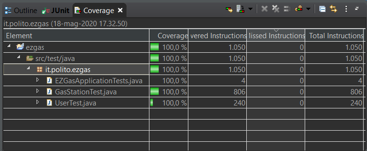

# Unit Testing Documentation

Authors: Finocchiaro Loredana, Marino Matteo, Mc Mahon Shannon

Date: 18/05/2020

Version: 1

# Contents

- [Black Box Unit Tests](#black-box-unit-tests)

- [White Box Unit Tests](#white-box-unit-tests)

# Black Box Unit Tests

## Note from Authors

In it.polito.ezgas.GasStationTest, it.polito.ezgas.UserTest you can find tests for all setters, getters and Constructors related to the Entity package. 
However, for the scope of this document we chose specific methods per class to test. Specifically, for each class we tested the Constructor and one getter and setter per type of field (getter and setter for a field of type Integer, getter and setter for a field of type Boolean, etc.). 
Note that invalid test cases cannot actually be tested in the code because the system reports errors just at compile time.   
For the Black Box analysis, we assumed that even negative values for both userId and gasStationId are accepted; in the coding, the check will be performed by service functions that will call these methods (setters and getters), so negative values will never be set.  
In it.polito.ezgas.GasStationDtoTest, it.polito.ezgas.UserDtoTest, it.polito.ezgas.oginDtoAndIdPwTest you can find tests for all setters, getters and Constructors related to the Dto package. We chose not to analyze them in this document as they are conceptually the same to the entity tests.

 ### **Class *User* - method *setUserId(Integer userId)***

**Criteria for method setUserId(Integer userId):**
	
 - Type of userId
 - Range of userId

**Predicates for method setUserId(Integer userId):**

| Criteria | Predicate |
| -------- | --------- |
| Type of userId |     Integer      |
|                |     Others      |
|    Range of userId  |     >=-32768 and <=32767     |
|          |     > 32767      |
|          |    < -32768      |

**Boundaries**:

| Criteria | Boundary values |
| -------- | --------------- |
|   Type of userId   |   None   |
|     Range of userId   |  -32768, -32769, -32767, 32767, 32768, 32766  |

**Combination of predicates**:

| Type of userId | Range of userId | Valid / Invalid | Description of the test case | JUnit test case |
|-------|-------|-------|-------|-------|
| Integer | >=-32768 and <=32767 | Valid | User user = new User();   user.setUserId(5); | it.polito.ezgas.UserTest.testSetUserId() |
| | > 32767 | Invalid | User user = new User();   user.setUserId(45000) -> error |  |
| | < -32768 | Invalid | User user = new User();   user.setUserId(-45000) -> error |  |
| Others | - | Invalid | User user = new User();   user.setUserId("abcde") -> error |  |

### **Class *User* - method *getUserId()***

**Criteria for method *getUserId()*:**

 - Type of output
 
**Predicates for method *getUserId()*:**

| Criteria | Predicate |
| -------- | --------- |
| Type of output | Integer |
|| Others |

**Boundaries**:

| Criteria | Boundary values |
| -------- | --------------- |
|   Type of output  |   None   |

**Combination of predicates**:

| Type of output | Valid / Invalid | Description of the test case | JUnit test case |
|-------|-------|-------|-------|
| Integer | Valid | User user = new User();   user.setUserId(5);   Integer id = user.getUserId(); | it.polito.ezgas.UserTest.testGetUserId() |
| Others | Invalid | User user = new User();   user.setUserId(5);   Integer id = user.getUserId() -> error (if the type of output is not Integer) |  |

### **Class *User* - method *setAdmin(Boolean admin)***

**Criteria for method *setAdmin(Boolean admin)*:**
	
 - Type of admin

**Predicates for method *setAdmin(Boolean admin)*:**

| Criteria | Predicate |
| -------- | --------- |
| Types of admin | Boolean |
|          | Others |

**Boundaries**:

| Criteria | Boundary values|
| -------- | ---------------|
| Type of admin | None |

**Combination of predicates**:

| Type of admin | Valid / Invalid | Description of the test case | JUnit test case |
|-------|-------|-------|-------|
Boolean | Valid | User user = new User();   user.setAdmin(true); | it.polito.ezgas.UserTest.testSetAdmin()|
Others | Invalid | User user = new User();   user.setAdmin(5) -> error |  |

### **Class *User* - method *getAdmin()***

**Criteria for method *getAdmin()*:**
	
 - Type of output

**Predicates for method *getAdmin()*:**

| Criteria | Predicate |
| -------- | --------- |
| Type of output | Boolean |
|          | Others |

**Boundaries**:

| Criteria | Boundary values |
| -------- | --------------- |
| Type of output | None |

**Combination of predicates**:

| Types of output | Valid / Invalid | Description of the test case | JUnit test case |
|-------|-------|-------|-------|
| Boolean | Valid | User user = new User();   user.setAdmin(true);   Boolean a = user.getAdmin(); |it.polito.ezgas.UserTest.testGetAdmin()|
| Others | Invalid | User user = new User();   user.setAdmin(true);   Boolean a = user.getAdmin() -> error (if the type of output is not Boolean) |  |

### **Class *User* - method *setUserName(String userName)***

**Criteria for method setUserName(String userName):**
	
 - Type of userName
 - Length of userName

**Predicates for method setUserName(String userName):**

| Criteria | Predicate |
| -------- | --------- |
| Type of userName |     String      |
|                |     Others      |
| Length of userName | >= 0 and <= maxValue |
|                    | > maxValue |

**Boundaries**:

| Criteria | Boundary values |
| -------- | --------------- |
|   Type of userName   |   None   |
| Length of userName | 0, maxValue, maxValue+1 |

**Combination of predicates**:

| Type of userName | Length of userName | Valid / Invalid | Description of the test case | JUnit test case |
|-------|-------|-------|-------|-------|
| String | >=0 and <= maxValue |  Valid | User user = new User();   user.setUserName("Mario"); | it.polito.ezgas.UserTest.testSetUserName() |
|  | > maxValue |  Invalid | User user = new User();   user.setUserName("abcde...") -> error (because I try to set a string whose length is > maxValue) |  |
| Others | - | Invalid |  User user = new User();   user.setUserName(5)  -> error |  |

### **Class *User* - method *getUserName()***

**Criteria for method getUserName():**
	
 - Type of output

**Predicates for method getUserName():**

| Criteria | Predicate |
| -------- | --------- |
| Type of output |     String      |
|                |     Others      |

**Boundaries**:

| Criteria | Boundary values |
| -------- | --------------- |
|   Type of output   |   None   |

**Combination of predicates**:

| Type of output |  Valid / Invalid | Description of the test case | JUnit test case |
|-------|-------|-------|-------|
| String |  Valid | User user = new User();   user.setUserName("Mario");   String name = user.getUserName(); | it.polito.ezgas.UserTest.testGetUserName() |
| Others |  Invalid | User user = new User();   user.setUserName("Mario");   String name = user.getUserName() -> error (if the type of output is not String) |  |

### **Class *User* - method *User(String userName, String password, String email, Integer reputation)***

**Criteria for method *User(String userName, String password, String email, Integer reputation)*:**
	
 - Number of parameters
 - Types of input sequence

**Predicates for method *User(String userName, String password, String email, Integer reputation)*:**

| Criteria | Predicate |
| -------- | --------- |
| Number of parameters | 4 |
|          | Different from 4 |
| Types of input sequence | String, String, String, Integer |
|          | Other combinations |

**Boundaries**:

| Criteria | Boundary values |
| -------- | --------------- |
| Number of parameters | None |
| Types of input sequence | None |

**Combination of predicates**:

| Number of parameters | Types of input sequence | Valid / Invalid | Description of the test case | JUnit test case |
|-------|-------|-------|-------|-------|
| 4 | String, String, String, Integer | Valid | User user = new User("Mario", "Rossi", "mario@ezgas.com", 5); | it.polito.ezgas.UserTest.testUserConstructor() |
|| Other combinations | Invalid | User user = new User(5, "Mario", "Rossi", "mario@ezgas.com") -> error |  |
| Different from 4 | - | Invalid | User user = new User(5) -> error |  |

### **Class *GasStation* - method *setGasStationId( Integer gasStationId )***

**Criteria for method *setGasStationId(Integer gasStationId)*:**
	
- Type of gasStationId
- Range of gasStationId

**Predicates for method *setGasStationId(Integer gasStationId)*:**

| Criteria | Predicate |
| -------- | --------- |
| Type of gasStationId |     Integer      |
|                |     Others      |
|    Range of gasStationId  |     >=-32768 and <=32767     |
|          |     > 32767      |
|          |    < -32768      |

**Boundaries**:

| Criteria | Boundary values |
| -------- | --------------- |
|   Type of gasStationId   |   None   |
|     Range of gasStationId  |  -32768, -32769, -32767, 32767, 32768, 32766  |

**Combination of predicates**:

| Type of gasStationId | Range of gasStationId | Valid / Invalid | Description of the test case | JUnit test case |
|-------|-------|-------|-------|-------|
| Integer | >=-32768 and <=32767 | Valid | GasStation gs = new GasStation();   gs.setGasStationId(5); | it.polito.ezgas.GasStationTest.testSetGasStationId() |
| | > 32767 | Invalid | GasStation gs = new GasStation();   gs.setGasStationId(45000) -> error |  |
| | < -32768 | Invalid | GasStation gs = new GasStation();   gs.setGasStationId(-45000) -> error |  |
| Others | - | Invalid | GasStation gs = new GasStation();   gs.setGasStationId("abc") -> error |  |

### **Class *GasStation* - method *getGasStationId()***

**Criteria for method *getGasStationId()*:**

 - Type of output
 
**Predicates for method *getGasStationId()*:**

| Criteria | Predicate |
| -------- | --------- |
| Type of output | Integer |
|| Others |

**Boundaries**:

| Criteria | Boundary values |
| -------- | --------------- |
|   Type of output  |   None   |

**Combination of predicates**:

| Type of output | Valid / Invalid | Description of the test case | JUnit test case |
|-------|-------|-------|-------|
| Integer | Valid | GasStation gs = new GasStation();   gs.setGasStationId();   Integer id = gs.getGasStationId(); | it.polito.ezgas.GasStationTest.testGetGasStationId() |
| Other | Invalid | GasStation gs = new GasStation();   gs.setGasStationId();   Integer id = gs.getGasStationId();-> error (if the type of output is not Integer) |  |

### **Class *GasStation* - method *setGasStationName(String gasStationName)***

**Criteria for method setGasStationName(String gasStationName):**
	
 - Type of gasStationName
 - Length of gasStationName

**Predicates for method setGasStationName(String gasStationName):**

| Criteria | Predicate |
| -------- | --------- |
| Type of gasStationName |   String   |
|                |   Others   |
| Length of gasStationName | >= 0 and <= maxValue |
|                    | > maxValue |

**Boundaries**:

| Criteria | Boundary values |
| -------- | --------------- |
|   Type of gasStationName   |   None   |
|   Length of gasStationName | 0, maxValue, maxValue+1 |

**Combination of predicates**:

| Type of gasStationName | Length of gasStationName | Valid / Invalid | Description of the test case | JUnit test case |
|-------|-------|-------|-------|-------|
| String | >= 0 and <= maxValue | Valid | GasStation gasStation = new GasStation();   gasStation.setGasStationName("GasStationTest"); | it.polito.ezgas.GasStationTest.testSetGasStationName() |
| String | > maxValue | Invalid | GasStation gasStation = new GasStation();   gasStation.setGasStationName(("abcde...") -> error (because I try to set a string whose length is > maxValue) |  |
| Others | - | Invalid |  GasStation gasStation = new GasStation();   gasStation.setGasStationName(23.5) -> error |  |

### **Class *GasStation* - method *getGasStationName()***

**Criteria for method getGasStationName():**
	
 - Type of output

**Predicates for method getGasStationName():**

| Criteria | Predicate |
| -------- | --------- |
| Type of output |     String      |
|                |     Others      |

**Boundaries**:

| Criteria | Boundary values |
| -------- | --------------- |
|   Type of output   |   None   |

**Combination of predicates**:

| Type of output |  Valid / Invalid | Description of the test case | JUnit test case |
|-------|-------|-------|-------|
| String |  Valid | GasStation gasStation = new GasStation();   gasStation.setGasStationName("GasStationTest");   String gs = gasStation.getGasStationName(); | it.polito.ezgas.GasStationTest.testGetGasStationName() |
| Others |  Invalid |  GasStation gasStation = new GasStation();   gasStation.setGasStationName("GasStationTest");   String gs = gasStation.getGasStationName() -> error (if the type of output is not String) |  |

### **Class *GasStation* - method *setHasDiesel(Boolean hasDiesel)***

**Criteria for method *setHasDiesel(Boolean hasDiesel)*:**
	
 - Type of hasDiesel

**Predicates for method *setHasDiesel(Boolean hasDiesel)*:**

| Criteria | Predicate |
| -------- | --------- |
| Type of hasDiesel | Boolean |
|          | Others |

**Boundaries**:

| Criteria | Boundary values|
| -------- | ---------------|
| Type of hasDiesel | None |

**Combination of predicates**:

| Type of hasDiesel | Valid / Invalid | Description of the test case | JUnit test case |
|-------|-------|-------|-------|
| Boolean | Valid | GasStation gs = new GasStation();  gs.setHasDiesel(true); | it.polito.ezgas.GasStationTest.testSetHasDiesel()|
| Others | Invalid | GasStation gs = new GasStation();   gs.setHasDiesel(5) -> error |  |

### **Class *GasStation* - method *getHasDiesel()***

**Criteria for method *getHasDiesel()*:**
	
 - Type of output

**Predicates for method *getHasDiesel()*:**

| Criteria | Predicate |
| -------- | --------- |
| Type of output | Boolean |
|          | Others |

**Boundaries**:

| Criteria | Boundary values |
| -------- | --------------- |
| Type of output | None |

**Combination of predicates**:

| Types of output | Valid / Invalid | Description of the test case | JUnit test case |
|-------|-------|-------|-------|
| Boolean | Valid | GasStation gs = new GasStation();   gs.setHasDiesel(true);   Boolean bool = gs.getHasDiesel();|it.polito.ezgas.GasStationTest.testGetHasDiesel()|
| Other | Invalid | GasStation gs = new GasStation();   gs.setHasDiesel(true);   Boolean bool = gs.getHasDiesel() -> error (if the type of output is not Boolean) |  |

### **Class *GasStation* - method *setDieselPrice(double dieselPrice)***

**Criteria for method setDieselPrice(double dieselPrice):**
	
 - Type of dieselPrice
 - Range of dieselPrice

**Predicates for method setDieselPrice(double dieselPrice):**

| Criteria | Predicate |
| -------- | --------- |
| Type of dieselPrice |     Double      |
|                |     Others      |
|    Range of dieselPrice  |     >= minDouble and <= maxDouble     |
|          |     > maxDouble      |
|          |    < minDouble      |

**Boundaries**:

| Criteria | Boundary values |
| -------- | --------------- |
|   Type of dieselPrice   |   None   |
|     Range of dieselPrice |  minDouble, minDouble-1, maxDouble, maxDouble+1  |

**Combination of predicates**:

| Type of dieselPrice | Range of dieselPrice | Valid / Invalid | Description of the test case | JUnit test case |
|-------|-------|-------|-------|-------|
| Double |  >= minDouble and <= maxDouble  | Valid | GasStation gasStation = new GasStation();   gasStation.setDieselPrice(1.678); | it.polito.ezgas.GasStationTest.testSetDieselPrice() |
| |  > maxDouble | Invalid |  GasStation gasStation = new GasStation();   gasStation.setDieselPrice(maxDouble+1) -> error |  |
| | < minDouble  | Invalid |  GasStation gasStation = new GasStation();   gasStation.setDieselPrice(minDouble-1) -> error |  |
| Others | - | Invalid | GasStation gasStation = new GasStation();   gasStation.setDieselPrice("too much") -> error |  |

### **Class *GasStation* - method *getDieselPrice()***

**Criteria for method getDieselPrice():**
	
 - Type of output

**Predicates for method getDieselPrice():**

| Criteria | Predicate |
| -------- | --------- |
| Type of output |     Double      |
|                |     Others      |

**Boundaries**:

| Criteria | Boundary values |
| -------- | --------------- |
|   Type of output  |   None   |

**Combination of predicates**:

| Type of output | Valid / Invalid | Description of the test case | JUnit test case |
|-------|-------|-------|-------|
| Double |   Valid | GasStation gasStation = new GasStation();   gasStation.setDieselPrice(1.678);   Double price = gasStation.getDieselPrice() | it.polito.ezgas.GasStationTest.testGetDieselPrice() |
| Others | Invalid | GasStation gasStation = new GasStation();   gasStation.setDieselPrice(1.678);    Double dieselPrice = gasStation.getDieselPrice() -> error (if the type of output is not Double) |  |

### **Class *GasStation* - method *GasStation(String gasStationName, String gasStationAddress, boolean hasDiesel, boolean hasSuper, boolean hasSuperPlus, boolean hasGas, boolean hasMethane, String carSharing, double lat, double lon, double dieselPrice, double superPrice, double superPlusPrice, double gasPrice, double methanePrice, Integer reportUser, String reportTimestamp, double reportDependability)***

**Criteria for method *GasStation(String gasStationName, String gasStationAddress, ..)*:**	

 - Number of parameters
 - Types of input sequence

**Predicates for method *GasStation(String gasStationName, String gasStationAddress, ..)*:**

| Criteria | Predicate |
| -------- | --------- |
| Number of parameters | 18 |
|          | Different from 18 |
| Types of input sequence | (String, String, boolean, boolean, boolean, boolean, boolean, String, double, double, double, double, double, double, double, Integer, String, double) |
|          | Other combinations |

**Boundaries**:

| Criteria | Boundary values |
| -------- | --------------- |
| Number of parameters | None |
| Types of input sequence | None |

**Combination of predicates**:

| Number of parameters | Types of input sequence | Valid / Invalid | Description of the test case | JUnit test case |
|-------|-------|-------|-------|-------|
|18|String, String, boolean, boolean, boolean, boolean, boolean, String, double, double, double, double, double, double, double, Integer, String, double|Valid|Gas Station gs = new GasStation("Esso", "Viale Macallè 15 Piemont Italy", true, true, false, true, true, "Enjoy", 45.5517866, 8.050702, 1.50, 1.30, 0, 1.30, 1.20, 10, "2020/05/17-18:30:17", 5) |it.polito.ezgas.GasStationTest.testGasStationConstructor()||
||Other combinations|Invalid|Gas Station gs = new GasStation(*5*, "Viale Macallè 15 Piemont Italy", true, true, false, true, true, "Enjoy", 45.5517866, 8.050702, 1.50, 1.30, 0, 1.30, 1.20, 10, "2020/05/17-18:30:17", 5) -> error |  |
|Different from 18 | - | Invalid | GasStation gs = new GasStation(5) -> error |  |

# White Box Unit Tests

### Test cases definition

| Unit name | JUnit test case |
|--|--|
| User | it.polito.ezgas.UserTest.testSetUserId() |
|| it.polito.ezgas.UserTest.testGetUserId() |
|| it.polito.ezgas.UserTest.testSetUserName() | 
|| it.polito.ezgas.UserTest.testGetUserName() |
|| it.polito.ezgas.UserTest.testSetAdmin() |
|| it.polito.ezgas.UserTest.testGetAdmin() |
|| it.polito.ezgas.UserTest.testUserConstructor() |
| GasStation | it.polito.ezgas.GasStationTest.testSetGasStationId()|
|| it.polito.ezgas.GasStationTest.testGetGasStationId()|
|| it.polito.ezgas.GasStationTest.testSetGasStationName()|
|| it.polito.ezgas.GasStationTest.testGetStationName()|
|| it.polito.ezgas.GasStationTest.testSetHasDiesel()|
|| it.polito.ezgas.GasStationTest.testGetHasDiesel()|
|| it.polito.ezgas.GasStationTest.testSetDieselPrice()|
|| it.polito.ezgas.GasStationTest.testGetDieselPrice()|
|| it.polito.ezgas.GasStationTest.testGasStationConstructor() |

### Code coverage report

### Loop coverage analysis

|Unit name | Loop rows | Number of iterations | JUnit test case |
|---|---|---|---|
|||||
|||||
||||||

Not relevant, since there are no loops.

